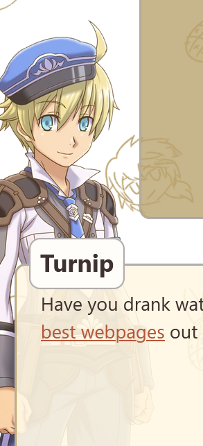
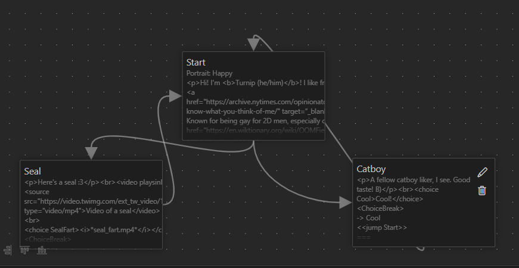

# Pineapple Fiber Spec

## Overview

Pineapple Fiber is a script that translates Yarn scripts into Typescript files that my custom-built DialogManager could
digest. It was made with the purpose of:

1. Making iterations easier by using the VSCode Yarnspinner plugin as a playable prototype of the dialogs
2. Making it more robust and flexible to changes
3. Seeing the dialogs as graph to make dialog writing much easier
4. Less clutter on *.svelte files

To use, just run the script!

## How to convert Yarn files to PineappleWeaver compliant typescript files

Run `npm run generate-yarn`

### How does it work?

## PineappleFiber-based Yarn File Format

For the latest specs, check
out [Yarn file format specs](https://github.com/YarnSpinnerTool/YarnSpinner/blob/main/Documentation/Yarn-Spec.md).

To make it clear which is Yarn-based definitions and PineappleFiber-based specifications, Yarn definitions are formatted
with a blockquote.

> Like this!

### Project

TODO: note yet implemented

> The Yarn project is all Yarn files that are intended to be associated with one another.

In PineappleFiber's world, these are the Typescript files importing each other! We might want this when we have common
dialogues between files. We'll need to investigate about this more since we might end up with cyclical dependencies, and
I would personally like to put a guard on it.

### Lines

> The line is the common unit that comprises all elements in a Yarn file. A line is a series of characters terminated by
> the new line symbol. The new line symbol should be either the \n character or \n. Once chosen, the new line symbol
> must remain the same throughout the project.

> The following Yarn file contains four lines (in order); one header tag line, one header delimiter line, one body
> dialogue line, one body delimiter line.

```yarn
title: Start
---
This is some text
===
```

### Whitespace

> Whitespace is any non-visible character with a width greater than 0. Common whitespace encountered include the space
> and the tab.

### Comments

> A comment is a line that starts with the // symbol. All text from the start of the comment to the end of the line must
> be ignored. A comment starting in the middle of another line ends that line at the point the // symbol is encountered.
> That line is assumed to have finished at that point as if the comment was not there. Comments must not impact the rest
> of the lines or have any impact on the resulting Yarn program. Comments may occur in any line of a Yarn file and take
> precedence over any other parsing rules such as hashtags, but may still be escaped.

### Identifiers

Check out
the [identifier specs](https://github.com/YarnSpinnerTool/YarnSpinner/blob/main/Documentation/Yarn-Spec.md#identifiers)!

## PineappleFiber-based Yarn Structure and extra definitions

Reminder: Blockquotes are direct quotes are from the original Yarn spec!

> The basic structure of a Yarn file is zero or more file tags and one or more Yarn nodes.


### File Tags

Not really relevant to us but here's the definition.

> File tags are file level metadata that is relevant for all nodes in the file. A common use for file tags is for
> versioning the file. File tags must go at the start of a file before any nodes begin. File tags must have the `#`
> symbol
> at the start of them and then contain all text up until the end of the line.


### Nodes

You'll find in PineappleFiber-based Yarn, we have three types of nodes! (Made it three types to reduce confusion.)

1. Original Yarn node
2. Choiceless PineappleFiber node
3. Diverging PineappleFiber node

The rest of the nodes are based on the Original Yarn node.

#### (1) Original Yarn node

> A node is the single story element of a Yarn file. Nodes are the story structural building blocks of Yarn; they are
> designed to contain pieces of a story and then have these story pieces linked together. This is not a
> requirement--everything could be done in a single node--but avoidance of the node structure quickly becomes unwieldy
> for
> the author. A node must be comprised of a single header and a single body in that order.


To document the above in text form, we want to define concepts above prefixed with *part* and literal characters with
*literal*. The same structure in the image is defined as:

In text form, this looks like:

1. part - header
2. literal - `---`
3. literal - NEWLINE (\n)
4. part - body
5. literal - `---`
6. literal - NEWLINE (\n)

This looks like:

```yarn
title: Start
---
This is some text
===
```

#### (2) Choiceless PineappleFiber node

Choiceless PineappleFiber is the original Yarn node but with special metatags for PineappleFiber. The structure is
as-follows:

1. part - header
2. literal - `---`
3. literal - NEWLINE (\n)
4. part - (optional) [Pineapple metatags](#Pineapple-metatags)
5. part - body
6. literal - `===`
7. literal - NEWLINE (\n)

```yarn
title: Start
---
Portrait: AresNeutral
This is some text
===
```

#### (3) Diverging PineappleFiber node

Diverging PineappleFiber is based on the Choiceless PineappleFiber node but with a new part that creates links.
The structure is as-follows:

1. part - header
2. literal - `---`
3. literal - NEWLINE (\n)
4. part - (optional) [Pineapple metatags](#Pineapple-metatags)
5. part - body with [choice tags](#Choice-tag)
6. literal - `<ChoiceBreak>`
7. literal - NEWLINE (\n)
8. literal - (optional for formatting) NEWLINE (\n)
9. literal - [Choice directory](#Choice-directory)
10. literal - `===`
11. literal - NEWLINE (\n)

```yarn
title: Start
---
Portrait: AresNeutral
This is some text
This is <choice FirstChoice>a choice</choice>.
This is <choice AnotherChoice>another choice</choice>.
<ChoiceBreak>

-> FirstChoice
    <<jump DirectNode>>
-> Second Choice
    <<jump AnotherNode>>
===
```

### Pineapple metatags

Note: these are case-insensitive!

<table>
<tr>
    <th>Name</th>
    <th>Description</th>
    <th>Example</th>
</tr>
<tr>
    <td>Portrait</td>
    <td>(Optional) This is the portrait that appears in the web (see Figure 3.1). By default or 
    when omitted, this is AresNeutral.</td>
    <td>Portrait: AresHappy</td>
</tr>
</table>




Figure 3.1. How Portait: AresHappy is rendered.

### Choice tag

Choice tags can be used in the **body**. A choice tag is a html tag with one attribute, which we'll call the **choice
name**. Enclosed is the **content** which can be any text that does not contain the characters `<` or `>`. The structure
is
as follows:

1. literal - `<choice`
2. literal - SPACE
3. part - choice name
4. literal -`
5. part - content
6. literal - `</choice>`

```html

<choice FirstChoice>a choice</choice>
```

All the **choice name** in the **body** should have an equivalent **choice name** in the
**[choice directory](#Choice-directory)**.

### Choice directory

The choice directory is a list of **Yarn options**. Each **Yarn option** has an equivalent **choice name** found in the
**body**. Check out what options are in
the [YarnSpinner doc](https://docs.yarnspinner.dev/getting-started/writing-in-yarn/lines-nodes-and-options#options).

The options must have a **jump line** which is a **Yarn Jump** command that leads to another existing Node.

The structure of a single option is as follows:

1. part - Yarn option
2. part - jump line

```yarn
-> FirstChoice
    <<jump DirectNode>>
```

## PineappleFiber Typescript equivalent

When generated, each node is converted into a DialogDetail. A DialogDetail is composed of three parts:

1. textContent: The body in a Yarn node.
2. dialogId: The title or Yarn node name. Whatever is the node called Start or the first node, it will be the first node
   ran when the dialogManager is run.
3. portraitType: The PineappleFiber metatag Portrait equivalent in enum PortraitType. Defaults as AresNeutral.

As an example, here's the Yarn script.

```yarn
# in About.yarn

title: Start
position: 0,0
---
Portrait: Happy
<p>Hi! I'm <b>Turnip (he/him)</b>! I like french fries, and seals! I fear being
<a href="https://archive.nytimes.com/opinionator.blogs.nytimes.com/2013/06/15/i-know-what-you-think-of-me/" target=”_blank”>perceived</a>.
Known for being gay for 2D men, especially catboys. Hope we can be <a href="https://en.wiktionary.org/wiki/OOMFie" target=”_blank”>oomfies!</a><br>ヾ(≧ ▽ ≦)ゝ</p>
<choice Catboy>I like catboys too!</choice> | <choice Seal>I like seals!</choice>
<ChoiceBreak>

-> Catboy
    <<jump Catboy>>
-> Seal
    <<jump Seal>>
===
title: Catboy
position: 238,149
---
<p>A fellow catboy liker, I see. Good taste! B)</p><br><choice Cool>Cool!</choice>
<ChoiceBreak>

-> Cool
    <<jump Start>>
===
title: Seal
position: -227,152
---
<p>Here's a seal :3</p><br><video playsinline autoplay muted loop style="max-height: 5rem;">
<source src="https://video.twimg.com/ext_tw_video/1318728494256410624/pu/vid/640x360/TMklz6hiTkQu3xhn.mp4" type="video/mp4">Video of a seal</video>
<br>
<choice SealFart><i>*seal_fart.mp4*</i></choice>
<ChoiceBreak>

-> SealFart
    <<jump Start>>
===
```

Here's what it looks like in YarnSpinner graph mode:



In Typescript, this would look like:

```typescript
// in About.ts

// auto-generated from About.yarn

import { dialogManager } from "$pkg/store";
import { PortraitType } from "$pkg/types/pineapple_fiber/PortraitType";

class _AboutYarn {
   setDialogTree = () => {
      dialogManager.setDialogTree([
         {
            textContent: `<p>Hi! I'm <b>Turnip (he/him)</b>! I like french fries, and seals! I fear being
    <a href="https://archive.nytimes.com/opinionator.blogs.nytimes.com/2013/06/15/i-know-what-you-think-of-me/" target="”_blank”">perceived</a>.
Known for being gay for 2D men, especially catboys. Hope we can be <a href="https://en.wiktionary.org/wiki/OOMFie" target="”_blank”">oomfies!</a><br>ヾ(≧ ▽ ≦)ゝ</p>
<a href="#" class="choice-Catboy dialog-choice">I like catboys too!</a> | <a href="#" class="choice-Seal dialog-choice">I like seals!</a>`,
            dialogId: "Start",
            portraitType: PortraitType.AresNeutral
         },
         {
            textContent: `<p>A fellow catboy liker, I see. Good taste! B)</p><br><a href="#" class="choice-Start dialog-choice">Cool!</a>`,
            dialogId: "Catboy",
            portraitType: PortraitType.AresLetsGo
         },
         {
            textContent: `<p>Here's a seal :3</p><br><video playsinline autoplay muted loop style="max-height: 5rem;">
<source src="https://video.twimg.com/ext_tw_video/1318728494256410624/pu/vid/640x360/TMklz6hiTkQu3xhn.mp4"
type="video/mp4">Video of a seal
</video><br><a href="#" class="choice-Start dialog-choice"><i>*seal_fart.mp4*</i></a>`,
            dialogId: "Seal",
            portraitType: PortraitType.AresYay
         }
      ]);
   };
}

export const AboutYarn = new _AboutYarn();

```

## PineappleFiber metadata

Variables are stored as `$variableName` in our localStorage.

Visited nodes are stored as an integer number like `+NodeName`

Note that the variable is updated AFTER the line is processed during runtime.
